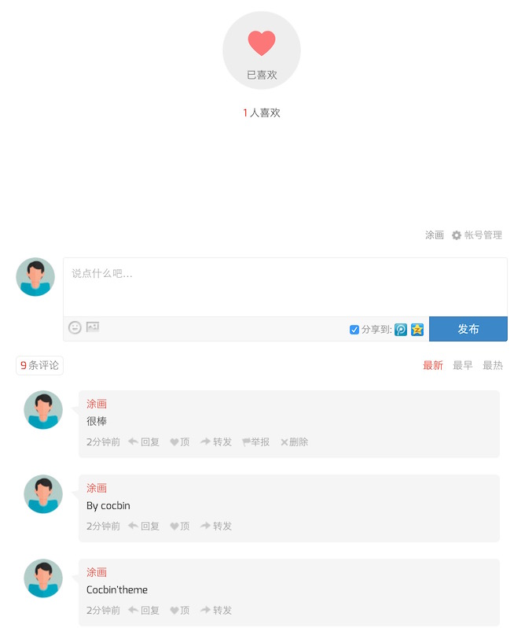
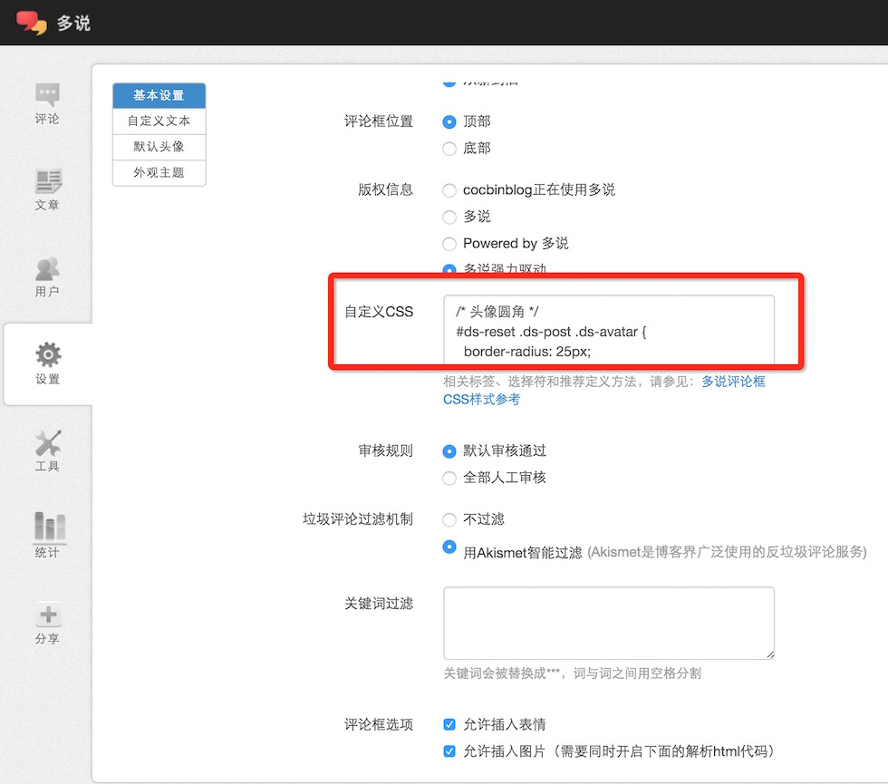

# duoshuo-embed-cocbin-theme.css
一个自定义的多说评论样式，适合扁平化网站。
    
## 效果预览

## 用法
进入多说后台，将duoshuo-embed-cocbin-theme.css中的代码复制到自定义css中，刷新网页。


**注意：** 喜欢按钮的心形是提前放在html中的iconfont,可以修改成图片或者其他iconfont。具体看下面的说明

## 说明


#### 头像圆角 

```
#ds-reset .ds-post .ds-avatar {
  border-radius: 25px;
  overflow: hidden;
  border: none;
}
```

#### 边框颜色 

```
#ds-thread #ds-reset li.ds-post {
  border:none;
  position:relative;
}
```


#### 气泡评论框 

##### 颜色、圆角、位置偏移
```
#ds-thread #ds-reset .ds-comment-body {
  background-color: #f5f5f5;
  border-radius: 5px;
  margin-left: 70px;
  padding: 10px;
}
```


##### 左边三角形 

```
#ds-thread #ds-reset .ds-post-self:after {
   width: 0;
   height: 0;
   border-top: 2px solid transparent;
   border-right: 10px solid #f5f5f5;
   border-bottom: 10px solid transparent;
   visibility:visible;
   content:"";
   position:absolute;
   left:70px;
   top:30px;
}
```

##### 适配嵌套左边三角形评论位置 

```
#ds-thread #ds-reset ul.ds-children .ds-post-self:after {
  left:32px;
}
```

##### 适配嵌套评论气泡框位置

```
#ds-thread #ds-reset ul.ds-children .ds-comment-body {
  padding:10px;
  margin-left:42px;
}
```

#### 修改喜欢按钮
##### 去除喜欢下面的分割线 加大边距

```
#ds-thread #ds-reset .ds-meta {
  border:none;
  margin-bottom: 100px;
  margin-top: 100px;
  text-align: center;
}

#ds-thread #ds-reset .ds-like-panel {
  line-height: 60px;
}
```

##### 喜欢按钮  居中 圆形 
```
#ds-thread #ds-reset a.ds-like-thread-button {
  display: block;
  width: 80px;
  height: 80px;
  border-radius: 50px;
  padding: 10px;
  margin: 0 auto;
}
```

#####喜欢按钮 心形 

```
#ds-thread #ds-reset a.ds-like-thread-button .ds-icon-heart  {
  background: none;
  width: 40px;
  height: 40px;
  display: block;
  padding-top: 20px;
  margin: 0 auto;
}
```

##### 自定义心形
 这里的iconfont是提前放在html文件里面的，'\e603'是我使用的iconfon对应的心形编码

```
#ds-thread #ds-reset a.ds-like-thread-button .ds-icon-heart:before {
  content: '\e603';
  display: block;
  font-family: iconfont;
  font-size: 40px;
  color: #999;
}
```
##### 修改喜欢按钮背景

```
#ds-thread #ds-reset a.ds-like-thread-button {
  border:none;
  background:#eee;
}

#ds-thread #ds-reset a.ds-thread-liked .ds-icon-heart:before {
  color: rgb(252, 120, 120);
}
```


#### 评论输入框
##### 圆头像 

```
#ds-thread #ds-reset .ds-replybox .ds-avatar img {
  border-radius: 25px;
}
```
##### 取消头像阴影 

```
#ds-reset .ds-avatar img {
  box-shadow:none;
}
```

##### 评论输入框 去掉内阴影 

```
#ds-thread #ds-reset .ds-textarea-wrapper textarea {
  background: #fff;
}
```
##### 取消渐变背景 

```
#ds-reset .ds-gradient-bg  {
  background: #f8f8f8;
  outline: none;
}
```

##### 扁平化发布按钮 

```
#ds-thread #ds-reset .ds-post-button {
  background: #3b87c8;
  border:1px solid #2e6da4;
  color:#fff;
  transition: background-color .2s;
  text-shadow: none;
  box-shadow: none;
}

#ds-thread #ds-reset .ds-post-button:hover {
  background: #337ab7;
  color:#fff;
}
```

##### 输入框颜色调亮 

```
#ds-thread #ds-reset .ds-textarea-wrapper ,#ds-thread #ds-reset .ds-post-options {
  border-color: #eee;
}
```

##### n条评论， 扁平化 

```
#ds-thread #ds-reset li.ds-tab a.ds-current {
  background: none;
  border-color: #eee;
}
```

##### 取消末尾分割线 

```
#ds-thread #ds-reset .ds-comments {
  border:none;
}
```

#### 多说版权信息居中 

```
#ds-thread #ds-reset .ds-powered-by {
  text-align: center;
}
```


